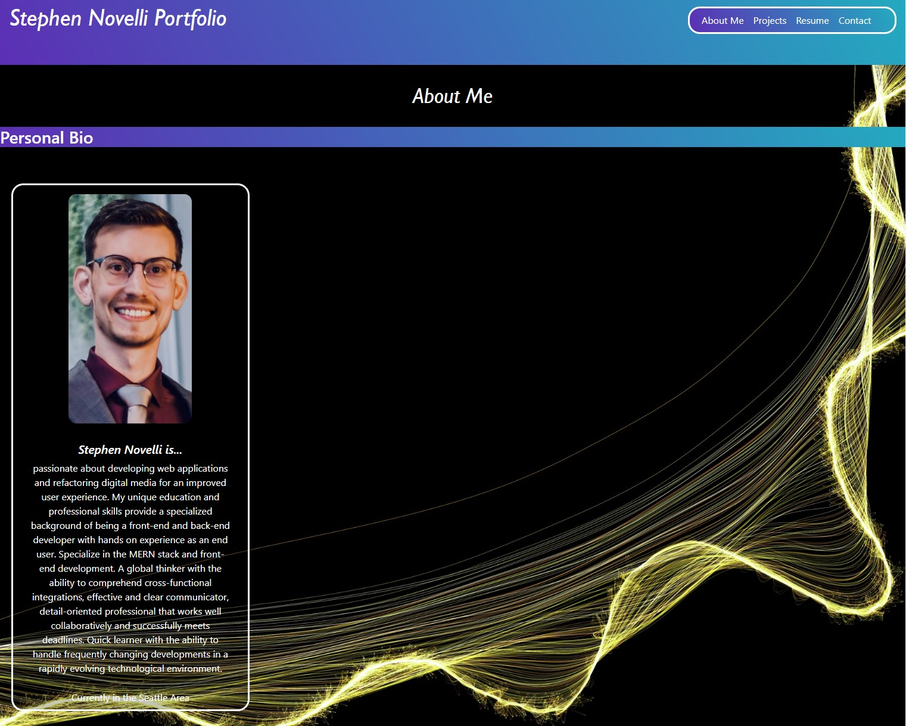

# Stephen Novelli Portfolio 
  
  # Table of Content
  - [Description](#Description)
  - [Installation](#Installation)
  - [Usage](#Usage)
  - [License](#License)
  - [Tests](#Tests)
  - [Preview](#Preview)
  - [Accreditations](#Accreditations)

   
## Description:
The following application uses the React.js library to build my personal portfolio. You can expect to find sections where you can learn about me, view some of my prjoects I completed for the University of Washington Fullstack Bootcamp, view and download a copy of my resume, and submit form data if you wish to contact me. This portfolio is an ongoing project that I will continue to update overtime as I learn more and gain experience. Feel free to have a look around!
    
## Installation:
You can find my portfolio available online and ready to view. Just click [here](https://) to begin to learning more about me.
    
## Usage:
You can visit my portfolio page at https:// where you will be presented with the About Me. Using the navigation links in the upper right corner, you are also given the options to view some of my completed projects from the University of Washington Fullstack Bootcamp, view and download a copy of my resume, and submit form data if you wish to contact me. If you wish to reach out to me directly, my email address has been added to the footer of the page, as well as links to my LinkedIn profile, my GitHub account, and to my City of Everett ArcGIS Online account to view some of my professional projects.

## License:
Copyright 2022, Stephen Novelli

Permission is hereby granted, free of charge, to any person obtaining a copy of this software and associated documentation files (the "Software"), to deal in the Software without restriction, including without limitation the rights to use, copy, modify, merge, publish, distribute, sublicense, and/or sell copies of the Software, and to permit persons to whom the Software is furnished to do so, subject to the following conditions:

The above copyright notice and this permission notice shall be included in all copies or substantial portions of the Software.

THE SOFTWARE IS PROVIDED "AS IS", WITHOUT WARRANTY OF ANY KIND, EXPRESS OR IMPLIED, INCLUDING BUT NOT LIMITED TO THE WARRANTIES OF MERCHANTABILITY, FITNESS FOR A PARTICULAR PURPOSE AND NONINFRINGEMENT. IN NO EVENT SHALL THE AUTHORS OR COPYRIGHT HOLDERS BE LIABLE FOR ANY CLAIM, DAMAGES OR OTHER LIABILITY, WHETHER IN AN ACTION OF CONTRACT, TORT OR OTHERWISE, ARISING FROM, OUT OF OR IN CONNECTION WITH THE SOFTWARE OR THE USE OR OTHER DEALINGS IN THE SOFTWARE.

[View License](https://www.mit.edu/~amini/LICENSE.md) 
    
    
## Tests:
No tests are required to view or run this application.
    
## Preview:

## Accreditations:
  Stephen Novelli's Portfolio was styled using the Boostrap framework and utilizes CoreUI to build some of the components that make up the UI. The application runs using the Node.js runtime environment, and is deployed for use publicly via Heroku. The background image can be found at the link in the following citation. **Image Source:** *Adam San, "BLACK AND GOLD HOT POWERPOINT BACKGROUND", SLIDEBACKGROUND.com, Feb 18, 2021, https://www.slidebackground.com/free-image/black-and-gold-hot-powerpoint-background-5112.html*
